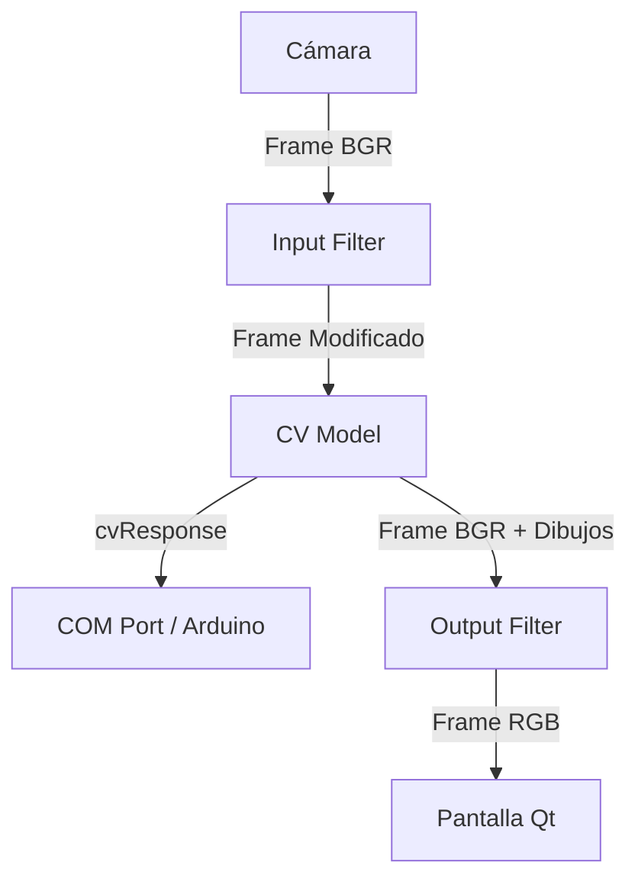

# Flujo de Código - GeneralCV

Este documento describe detalladamente la arquitectura de flujo de datos y el pipeline de ejecución de **GeneralCV**. El proyecto está estructurado utilizando un patrón **Strategy/Provider**, lo que permite intercambiar componentes (modelos de visión, cámaras, filtros, etc.) de manera dinámica en tiempo de ejecución.

## Ciclo Principal (Main Loop)
En lugar de utilizar un bucle `while True` clásico de OpenCV que bloquee el hilo de la interfaz de usuario, GeneralCV se integra con **PySide6** (Qt) utilizando `QTimer`.

En `main.py`, dentro de la inicialización de `MainWindow`, se configura un temporizador:

```python
self.timer = QTimer()
self.timer.timeout.connect(self.update_frame)
self.timer.start(30)
```
Esto significa que el método `update_frame()` es invocado aproximadamente cada 30 milisegundos, operando como el bucle principal de renderizado y procesamiento, manteniendo la interfaz gráfica totalmente receptiva (responsive).

## Pipeline de Procesamiento (Data Flow)

El flujo de información para cada iteración de `update_frame` sigue una estructura estricta y modular, manejada a través de distintos "Providers" (Proveedores).

### 1. Captura de Imagen (CamProvider)
El proceso inicia obteniendo el fotograma actual de la cámara seleccionada.
```python
frame = self.camProvider.getFrame()
```
El `CamProvider` delega esta acción al modelo de cámara instanciado (por ejemplo, una cámara OpenCV o un video).

### 2. Filtro de Entrada (Input FilterProvider)
Antes de enviar el fotograma al modelo de Computer Vision, se le puede aplicar un filtro de preprocesamiento (escalado, recorte, conversión de color, etc.).
```python
frameToCvProcess = self.inputFilterProvider.process(frame)
```

### 3. Modelo de Computer Vision (CvProvider)
El fotograma filtrado se envía al modelo de Inteligencia Artificial / Visión Artificial seleccionado (por ejemplo, `HandsCv`, basado en MediaPipe).
```python
frame, cvResponse = self.cvProvider.process(frameToCvProcess)
```
El modelo de CV procesa la imagen, dibuja landmarks o bounding boxes sobre el `frame`, y retorna tanto el fotograma modificado como una respuesta (`cvResponse`) con los metadatos de las detecciones (por ejemplo, las coordenadas de los dedos de una mano, estado abierto/cerrado, etc.).

### 4. Comunicación Externa (ComProvider)
La respuesta o metadatos (`cvResponse`) generados por el modelo CV se envían al módulo de comunicación. 
```python
self.comProvider.process(cvResponse)
```
Esto permite controlar hardware (como un Arduino por puerto Serial) o enviar datos a otro software mediante sockets, de manera completamente desacoplada.

### 5. Filtro de Salida (Output FilterProvider)
Antes de renderizar el fotograma en la pantalla, se realiza un ajuste final (como conversiones de espacio de color, ya que Qt usa RGB y OpenCV BGR).
```python
frame = cv2.cvtColor(frame, cv2.COLOR_BGR2RGB)
frame = self.outputFilterProvider.process(frame)
```

### 6. Visualización (ScreenProvider)
Finalmente, el fotograma resultante es inyectado en el componente gráfico de la interfaz de usuario mediante el `ScreenProvider`.
```python
self.screenProvider.showFrame(frame)
```
El `ScreenProvider` se encarga de convertir la matriz NumPy a un `QImage` y asignarla al `QLabel` (`self.ui.cam`) correspondiente.

## Resumen Gráfico del Flujo


